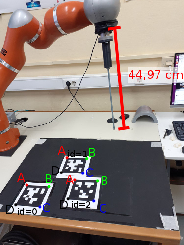

# ROS package for calibrating and tracking with apriltags

[The code is under development, bugs is to expected for now]

Dependencies: Ubuntu 16.04, ROS kinetic, `autharl_core`

We assume that in the same ROS workspace you have cloned and installed `autharl_core`. If not first take care of this. Then open up the display for the robot (LWR for now):

```
roslaunch apriltag_ros display.launch
```

Then start the camera (ASUS Xtion for now):

```
roslaunch openni2_launch openni2.launch camera:=asus_xtion
```

## Calibrate the camera with the robot

In order to find the transformation between the camera and the robot you should measure the positions of some tags with respect the robot. Use the black carton with the 3 tags on it and fix it on the table. Use the long surgical tool at the end of the kuka. (Number 7: ati sensor with the long tool which is 44.98 cm). Your setup now might look like this:



Then measure the positions of the points of the tag vertices with respect the robot's base frame, by using the tool. You can move the end-effector by touching the above vertices and see their position in teach pendant. Then, open up `apriltag_ros/config/params.yml` and put the measurements under `calibration` for each tag with the corresponding id number in meters. You can use the existing measurements named `lwr_1` as reference (please give a different name into your measurements). Notice that if you place the black carton in the exact same position as in the image above, there is no need to measure again and you can use measurements `lwr_1`. In case you add a new set of measurements, update the parameter `calibration/setup` with your measurements' name to let the calibration code know which measurements to use.

Place the camera in a position in which every tag is within its field of view. Then you can find the transformation between the camera and the robot by running:

```
roslaunch apriltag_ros calibrate.launch
```

If the parameter `calibration/plot` is true then it will throw a window with the detected vertices in the 2-D plane of the image (colored-coded as the image above). Press enter on the window to continue. Then it will find the transformation and it will write it within the `output/` directory. It will also plot the vertices of the tags in 3-D space in RViz.

Finally, to publish the transformation in TF run (and leave it running) the following: 

```
roslaunch apriltag_ros publish_calibration.launch
```

You can turn on the point cloud in RViz to check if the calibration is correct.

## Print a tag

In order to generate and print a tag you can set the parameters in `apriltag_ros/config/params.yml` under `pattern`. The parameters that you should provide are:

- `board_size`: The size of the grid. `[1, 1]` means that you will print one tag. `[2, 2]` it will print 4 tags in a grid configuration.
- `tile_size`: The size of the edges of the tag.
- `tile_offset`: An offset between tiles
- `tile_border`: The white area around the tag. Typically 1 cm.

The last three parameters are in meters.

Then run:

```
roslaunch apriltag_launch make_pattern.launch
```

It will output an svg file in `output/`.


## Track a tag

Having printed a tag you can track it by running: 

```
roslaunch apriltag_ros track.launch
```

You can read the the pose of the tag by listening to the ROS Tf transformation of `target_object` frame.

## Configuration


